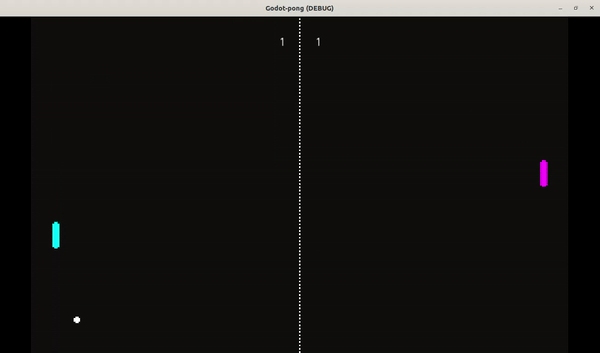

<h1 align="center">Pong</h1>

  

# Pong: O Retorno aos Anos 70 🕹️🌈

Bem-vindo à era dos disquetes e das cores psicodélicas! Prepare-se para mergulhar no clássico jogo Pong, uma jornada de volta aos tempos míticos dos anos 70, onde os pixels reinavam!

## Sobre o Jogo 🏓🎮

Pong é a essência dos videogames vintage! Com duas raquetes e uma bolinha, a diversão é garantida. É simples, é clássico, é viciante! Desafie um amigo ou aproveite o embate com a inteligência artificial.

## Como Jogar 🕹️⭐

1. Clone este repositório na sua máquina do tempo.
2. Este projeto foi desenvolvido com Godot Engine 3
3. Caso não possua, faça o Download aqui [Godot 3.5.2](https://godotengine.org/download/archive/3.5.3-stable/)
4. Inicia a Godot e importe seu projeto
5. Clique no botão play 🎮
6. Mova as raquetes com as teclas W e S para player one e  teclas 2 e 5 do teclado numérico para player two💥🕹️

## Características da Época 🌈✨

- **Gráficos Retrô:** Prepare-se para mergulhar nos pixels e nas cores vibrantes dos anos 70!
- **Trilha Sonora Groovy:** Sons eletrônicos e efeitos sonoros nostálgicos te levam de volta no tempo.
- **Diversão sem Fim:** Pong é atemporal, é simplesmente viciante!

## Estrutura do Arquivo 📁🚀

/  
|-- /assets # Recursos espaciais  
|-- /scenes # As cenas e objetos principais do game  
|-- /scripts # Scripts alienígenas  
|-- ...

## Legalidades 📜🌌

Este código está sob uma licença MIT mas o nome pode ser de propriedade particular.

## Vamos Viajar no Tempo! 🚀🌀

Pong é um portal para uma época onde os jogos eram simples e a diversão era imensa. Vamos fazer uma viagem juntos aos anos 70 com uma partida de Pong! 🏓✨

    

